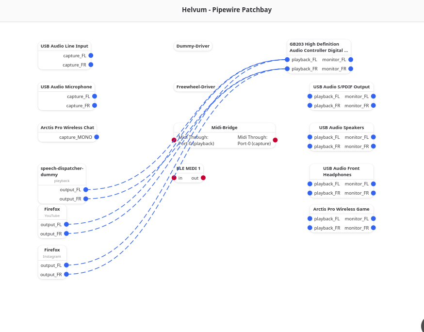

I started daily driving Fedora at home recently and it usually works.

Here is the running list of things that did not / stopped working. Each one has a TL;DR fix at the top, then the why, in case you hit the same thing six months from now.


## 1. Arctis Pro Wireless mic missing

**TL;DR:**

```bash
pactl set-card-profile alsa_card.usb-SteelSeries_Arctis_Pro_Wireless-00 \
    'output:stereo-game+input:mono-chat'
```

The headset audio output worked fine. But the only "Arctis"-named entry in any browser's mic picker was **"Monitor of Arctis Pro Wireless Game"**, which is a loopback of whatever's currently playing — selecting it produced silence.

The card was on profile `output:stereo-game`, which is output-only. The Arctis hardware exposes its mic as a separate ALSA "input" port (`usb-gaming-headset-input`), and that port is only attached when the active profile contains `input:mono-chat`. PipeWire / PulseAudio / WirePlumber will not invent a microphone that isn't bound by the profile.

The fix above flips to a profile that adds the chat input without changing the existing game-stereo output. WirePlumber persists the choice in `~/.local/state/wireplumber/`, so it survives reboots.

Two related gotchas worth filing in your head:

- **"Monitor of \<device\>" is _never_ a microphone.** It's a virtual source that captures whatever the playback sink is producing. If the only source you can find for a device is its monitor, the real input port isn't currently bound by the active profile.
- **The Arctis hardware-mutes the mic when the boom is rotated up.** If the source exists and is silent, check the boom before going deeper.

## 2. Corsair K70 TKL volume wheel jitter

**TL;DR:** Run a 50 ms evdev debounce filter as a systemd service.

The K70 RGB TKL's volume wheel has a hardware defect: scrolling _up_ slowly sends ~35% wrong-direction events. The encoder bounces. The kernel and libinput are faithfully reporting what the hardware sends; volume just jitters back and forth.

I wrote a small Python evdev filter that grabs the keyboard, forwards every non-volume event with zero added latency, and applies two techniques to volume events:

- **A 50 ms debounce window** that accumulates volume events and emits only the net direction.
- **A direction momentum lock** — once a clean run of events establishes a direction, noisy windows are forced to that direction. The lock resets after 200 ms of no input (a new gesture).

The before/after numbers from my own keyboard:

| Test      | Raw encoder | After filter |
| --------- | ----------- | ------------ |
| Slow DOWN | 100%        | 100%         |
| Slow UP   | 65%         | **100%**     |
| Fast DOWN | 100%        | 100%         |
| Fast UP   | 92%         | **95%**      |

Installation, once `python3-evdev` is on the box, is a `systemd` unit that runs the script as root (it needs `/dev/input/eventX` access). The script and unit file are in this site's repo: [`k70-volume-debounce.py`](https://github.com/nicholasmullikin/nick-website/blob/main/static/code/k70-volume-debounce/k70-volume-debounce.py) and [`k70-volume-debounce.service`](https://github.com/nicholasmullikin/nick-website/blob/main/static/code/k70-volume-debounce/k70-volume-debounce.service) (see the [folder README](https://github.com/nicholasmullikin/nick-website/blob/main/static/code/k70-volume-debounce/) for install steps and tuning flags).

## 3. Woojer Vest Edge USB destroys the entire audio graph in Wireplumber



**TL;DR:** Pin the Woojer's `priority.driver` to 0 in WirePlumber.

This one took an afternoon. Whenever I duplicated audio to multiple sinks in [Helvum](https://gitlab.freedesktop.org/pipewire/helvum) — speakers _plus_ the Woojer haptic vest — the **entire system audio** crackled, stuttered, and dropped out. Not just the Woojer. Everything.

The Woojer Vest Edge USB is a USB 1.1 full-speed device with sync type `NONE` — no asynchronous feedback endpoint, no adaptive timing, no clock recovery mechanism at all. Despite this, PipeWire was assigning it `priority.driver = 1109`, the **highest of any audio sink in my system**. When Helvum links a source to multiple sinks, PipeWire merges them into a single clock graph and picks the highest-priority device as the master clock. The Woojer's untrackable clock became the reference, and every other device on the graph was trying to chase it.

The fix is a WirePlumber drop-in at `~/.config/wireplumber/wireplumber.conf.d/51-woojer-fix.conf`:

```
monitor.alsa.rules = [
  {
    matches = [ { node.name = "~alsa_output.*Woojer.*" } ]
    actions = {
      update-props = {
        priority.driver      = 0
        api.alsa.headroom    = 1024
        api.alsa.period-size = 1024
        api.alsa.period-num  = 3
      }
    }
  }
]
```

`priority.driver = 0` removes the Woojer from contention as a clock master. A real clock (Arctis, USB DAC, HDMI) drives the graph instead, and the Woojer just chases. The headroom and period settings give the unsynced USB transport runway to absorb its own clock drift without xruns.

## 4. KDE Wallet prompts every login on GDM

**TL;DR:** Add `pam_kwallet5.so` to `/etc/pam.d/gdm-password`.

I'm running KDE Plasma but logging in through GDM (a holdover from a previous distro). KDE Wallet's auto-unlock relies on PAM telling it your login password at session start, and GDM's PAM stack ships with the GNOME keyring entries enabled but **no kwallet entries**. So every login: enter your password, then enter your wallet password too. Every Wi-Fi reconnect: same thing.

Two `sed -i` lines into the PAM config fix it:

```bash
sudo cp /etc/pam.d/gdm-password /etc/pam.d/gdm-password.backup
sudo sed -i '/pam_gnome_keyring.so$/a-auth        optional      pam_kwallet5.so' /etc/pam.d/gdm-password
sudo sed -i '/pam_gnome_keyring.so auto_start$/a-session     optional      pam_kwallet5.so auto_start' /etc/pam.d/gdm-password
```

The leading `-` makes the line non-fatal — if `pam_kwallet5.so` isn't installed, login still works. If your wallet password doesn't match your login password, you'll need to either change the wallet password to match or recreate the wallet (`kwalletmanager6` → right-click → Change Password).

## 5. NVIDIA module not loading after kernel update (Secure Boot + LUKS)

**TL;DR:**

```bash
sudo akmods --force
sudo dracut --force
```

...plus, the first time, a MOK key import.

The symptom is a journal full of `nvidia kernel module not found, using nouveau` after a kernel update — the modules built fine, they just aren't loading. Fedora kernel updates rebuild NVIDIA's out-of-tree modules through `akmods`, which signs them with the key at `/etc/pki/akmods/certs/public_key.der`. Secure Boot rejects unsigned kernel modules, so that key has to be enrolled in the firmware's MOK list, which you do once:

```bash
sudo mokutil --import /etc/pki/akmods/certs/public_key.der
# set a password, reboot, enroll in the MOK Manager screen
mokutil --list-enrolled | grep -i akmod   # verify after reboot
```

What gets you _every_ kernel update, though, is that LUKS-encrypted root filesystems need NVIDIA drivers in the initramfs (otherwise you get a black screen post-decryption while the kernel sits at "no driver loaded"). So `dracut --force` after every `akmods --force`. To avoid forgetting:

```bash
# /etc/dracut.conf.d/nvidia.conf
add_drivers+=" nvidia nvidia_modeset nvidia_uvm nvidia_drm "
```

And a kernel-install hook at `/etc/kernel/install.d/99-nvidia-akmods.install` that runs both commands automatically when a new kernel lands (logs to the journal under `nvidia-akmods` and `nvidia-dracut`). The hook is what you actually want long-term — manually rebuilding modules once per kernel is the kind of thing that fails three months later, on a Saturday, in a hurry.

## 6. SteamVR's flat 2D dashboard with the Bigscreen Beyond

**TL;DR:** This didn't fully work, but this at least stopped tit from fully not working.

```bash
chmod -x ~/.steam/steam/steamapps/common/SteamVR/bin/vrwebhelper/linux64/vrwebhelper
```

...then install [WayVR](https://wayvr.org/).

The SteamVR dashboard on Linux is a long-known broken component. It relies on `vrwebhelper` (Chromium/CEF), and the Linux build doesn't render a proper 3D environment — just a flat 2D surface in a void. This is not a setup issue you can fix; it's an upstream limitation. The [LVRA Quick Start](https://lvra.gitlab.io/docs/steamvr/quick-start/) recommends disabling the dashboard outright.

So you `chmod -x` it (reversible with `chmod +x`), and use a community replacement instead. WayVR (formerly WlxOverlay-S) is the current pick. It does _not_ bind the system/menu button by default — instead it uses a watch on your left wrist, which you summon by looking down at your left hand. The "show/hide all overlays" action is a double-press of B on the left controller (Index/Knuckles bindings). Bindings for other controllers live in `~/.config/wayvr/actions_binding_*.json`.

It's a slightly disorienting UX coming from SteamVR's sanctioned dashboard, but unlike the sanctioned dashboard it actually works.

## 7. WCN7850 Wi-Fi wedged after long S3 suspend

**TL;DR:**

```bash
echo s2idle | sudo tee /sys/power/mem_sleep
```

Persist with a kernel cmdline `mem_sleep_default=s2idle`.

I have an MSI MAG B850M MORTAR WIFI motherboard with the Qualcomm WCN7850 (M.2 packaging of "FastConnect 7800") on the `ath12k` driver. After a long S3 (deep) suspend — overnight, say — the chip's firmware sometimes ends up wedged in `SYS_ERROR` and the journal fills with:

```
qcom_mhi_qrtr mhi0_IPCR: PM: failed to resume early: error -22
mhi mhi0: Resuming from non M3 state (SYS ERROR)
ath12k_pci 0000:XX:00.0: failed to set mhi state: RESUME(7)
ath12k_pci 0000:XX:00.0: failed to wakeup from wow: -110
```

…repeating every three seconds, forever, until you cold-boot. Sometimes a `modprobe -r ath12k_wifi7 ath12k && modprobe ath12k_wifi7_pci` reloads the driver cleanly. Sometimes it doesn't.

Switching to `s2idle` (suspend-to-idle) avoids the buggy MHI resume path entirely. On my machine it's been stable across four clean s2idle cycles, against intermittent failures on S3. Two caveats:

- The S3 failure was n=1 in my own data — three of four prior S3 cycles resumed cleanly. Don't read too much into the apparent severity.
- WoWLAN-based remote wake doesn't work with s2idle on this board. If you need remote wake, use the wired NIC.
